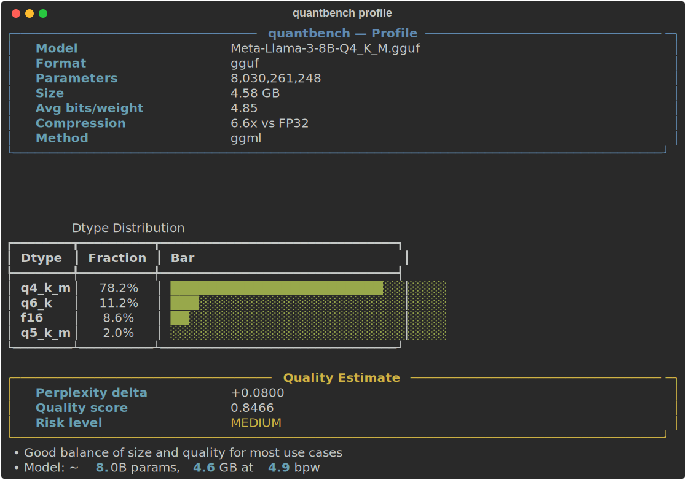
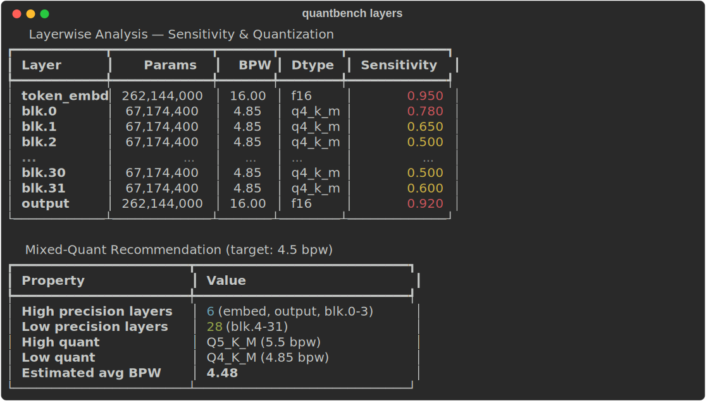

# quantbench

[](https://github.com/stef41/quantbench/actions/workflows/ci.yml)
[](https://www.python.org/downloads/)
[](LICENSE)

**Quantization quality analyzer for LLMs.** Pure-Python GGUF and safetensors parsing, layerwise sensitivity analysis, quality prediction, and mixed-quantization recommendations — zero dependencies.

Point quantbench at any `.gguf` or `.safetensors` file and get an instant quality report: dtype distribution, estimated perplexity impact, layer sensitivity scores, and mixed-precision recommendations.

<p align="center">
  
</p>

## Why quantbench?

| Problem | quantbench Solution |
|---|---|
| "Is Q4_K_M good enough for my use case?" | Estimated perplexity delta + risk level |
| No way to inspect GGUF internals without llama.cpp | Pure-Python parser — just `pip install` |
| Which layers are most sensitive to quantization? | Layerwise sensitivity scoring with position awareness |
| Choosing between Q4_K_M, Q5_K_S, Q6_K, etc. | Side-by-side format comparison with rankings |
| Mixed-precision quant is complex to configure | Automated recommendations targeting your bpw budget |

## Installation

```bash
pip install quantbench          # zero dependencies
pip install quantbench[cli]     # + click, rich for terminal UI
pip install quantbench[all]     # everything
```

## Quick Start

### 1. Profile a quantized model

```python
from quantbench import profile_gguf, estimate_quality

profile = profile_gguf("Meta-Llama-3-8B-Q4_K_M.gguf")

print(f"Model: {profile.name}")
print(f"Size: {profile.size_gb:.2f} GB")
print(f"Avg bits/weight: {profile.quant.avg_bits_per_weight:.2f}")
print(f"Compression: {profile.compression_ratio:.1f}x vs FP32")

quality = estimate_quality(profile)
print(f"Risk level: {quality.risk_level}")
print(f"Est. perplexity delta: +{quality.estimated_perplexity_delta:.4f}")
```

### 2. Layerwise analysis

<p align="center">
  
</p>

```python
from quantbench import profile_gguf, analyze_layers, layer_sensitivity

profile = profile_gguf("model.gguf")

# Get sensitivity scores
sensitivity = layer_sensitivity(profile)
for layer_name, score in sorted(sensitivity.items(), key=lambda x: -x[1])[:5]:
    print(f"  {layer_name}: {score:.3f}")

# Full layerwise breakdown
for row in analyze_layers(profile):
    print(f"{row['name']:30s} {row['avg_bits_per_weight']:5.2f} bpw  sens={row['sensitivity']:.3f}")
```

### 3. Compare quantization formats

```python
from quantbench import profile_gguf, compare_profiles, compare_formats

q4 = profile_gguf("model-Q4_K_M.gguf")
q5 = profile_gguf("model-Q5_K_M.gguf")
q8 = profile_gguf("model-Q8_0.gguf")

# Pairwise comparison
diff = compare_profiles(q4, q8)
print(f"Size delta: {diff['size_delta_bytes'] / 1e9:.2f} GB")
print(f"BPW delta: {diff['bpw_delta']:.2f}")

# Multi-format ranking
ranking = compare_formats([q4, q5, q8])
for row in ranking["ranking"]:
    print(f"  #{row['rank']} {row['name']} — {row['avg_bpw']:.2f} bpw, {row['size_gb']:.2f} GB")
```

### 4. Mixed-quantization recommendations

```python
from quantbench import profile_gguf, recommend_mixed_quant

profile = profile_gguf("model.gguf")
rec = recommend_mixed_quant(profile, target_bpw=4.5)

print(f"Target: {rec['target_bpw']} bpw → Estimated: {rec['estimated_avg_bpw']} bpw")
print(f"High precision: {rec['n_high_precision_layers']} layers ({rec['high_quant']})")
print(f"Low precision: {rec['n_low_precision_layers']} layers ({rec['low_quant']})")
```

### 5. Predict quality for any bpw

```python
from quantbench import perplexity_delta

for bpw in [8.0, 6.0, 5.0, 4.5, 4.0, 3.5, 3.0, 2.0]:
    delta = perplexity_delta(bpw)
    print(f"  {bpw:.1f} bpw → +{delta:.4f} perplexity")
```

## CLI

```bash
# Profile a GGUF or safetensors file
quantbench profile model.gguf

# Markdown output
quantbench profile model.gguf --markdown

# Save JSON report
quantbench profile model.gguf -o report.json

# Compare two files
quantbench compare model-Q4.gguf model-Q8.gguf

# Layerwise analysis
quantbench layers model.gguf

# Mixed-quant recommendation
quantbench recommend model.gguf --target-bpw 4.5
```

## Supported Formats

| Format | Parser | Status |
|---|---|---|
| GGUF (v2, v3) | Pure Python — reads header only | Full support |
| safetensors | Pure Python — reads JSON header only | Full support |

### Supported Dtypes

Q2_K, Q3_K_S, Q3_K_M, Q3_K_L, Q4_0, Q4_1, Q4_K_S, Q4_K_M, Q5_0, Q5_1, Q5_K_S, Q5_K_M, Q6_K, Q8_0, IQ1_S, IQ2_XXS, IQ3_XXS, IQ4_XS, F16, BF16, F32

## Architecture

```
quantbench/
├── _types.py        # DType, TensorInfo, LayerInfo, ModelProfile, QualityEstimate
├── profile.py       # Pure-Python GGUF & safetensors parsers
├── layerwise.py     # Layer sensitivity analysis, mixed-quant recommendations
├── compare.py       # Cross-format and pairwise comparisons
├── predict.py       # Quality estimation from bits-per-weight curves
├── report.py        # JSON/text/rich/markdown formatting
└── cli.py           # Click CLI interface
```

## See Also

Part of the **stef41 LLM toolkit** — open-source tools for every stage of the LLM lifecycle:

| Project | What it does |
|---------|-------------|
| [tokonomics](https://github.com/stef41/tokonomics) | Token counting & cost management for LLM APIs |
| [datacrux](https://github.com/stef41/datacrux) | Training data quality — dedup, PII, contamination |
| [castwright](https://github.com/stef41/castwright) | Synthetic instruction data generation |
| [datamix](https://github.com/stef41/datamix) | Dataset mixing & curriculum optimization |
| [toksight](https://github.com/stef41/toksight) | Tokenizer analysis & comparison |
| [trainpulse](https://github.com/stef41/trainpulse) | Training health monitoring |
| [ckpt](https://github.com/stef41/ckpt) | Checkpoint inspection, diffing & merging |
| [infermark](https://github.com/stef41/infermark) | Inference benchmarking |
| [modeldiff](https://github.com/stef41/modeldiff) | Behavioral regression testing |
| [vibesafe](https://github.com/stef41/vibesafe) | AI-generated code safety scanner |
| [injectionguard](https://github.com/stef41/injectionguard) | Prompt injection detection |

## License

Apache 2.0
